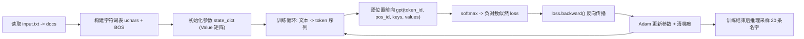

# microgpt.py 深度拆解（逐行逻辑 + 数学原理 + 工程作用）

- 分析对象：`/Users/liuyizhou/Documents/micro-gpt/karpathy-microgpt/microgpt.py`
- 基准版本（clone 后 HEAD）：`14fb038816c7aae0bb9342c2dbf1a51dd134a5ff`
- 源码总行数：`199`
- 文档目标：让你达到“可以不看源码复述完整训练流程，并独立做结构改造”的理解深度。

---

## 1. 项目定位与学习目标

### 1.1 这个项目到底是什么

`microgpt.py` 是一个“最小可运行 GPT 训练+推理系统”，具有下面几个硬约束：

1. 单文件。
2. 纯 Python 标准库（`os/math/random/urllib`），不依赖 NumPy/PyTorch。
3. 标量级自动微分（每个数值都是一个 `Value` 节点），完整链式求导。
4. Transformer 的核心结构具备：token embedding、position embedding、self-attention、MLP、残差、归一化。
5. 优化器使用 Adam，带 bias correction 和线性学习率衰减。

这意味着它不是“高性能训练器”，而是“可被完整看穿的算法剖面图”。

### 1.2 学完你应该能做到什么

你应达到以下能力：

1. 解释每一段代码在前向、反向、优化中的角色。
2. 将关键公式与变量一一映射（例如 `attn_logits` 对应 `QK^T/sqrt(d)`）。
3. 解释为什么该实现里不需要显式 causal mask。
4. 解释为什么 `softmax` 要减 `max`，为什么 Adam 要做 bias correction。
5. 预测改超参数（`n_embd/n_layer/temperature/num_steps`）后行为变化，并能用实验验证。

---

## 2. 运行环境与一键复现

### 2.1 环境要求

1. Python 3.10+（本机实测：`Python 3.12.12`）。
2. 可以联网（首次会下载 `names.txt` 到本地 `input.txt`）。

### 2.2 克隆与版本锁定

```bash
git clone https://gist.github.com/8627fe009c40f57531cb18360106ce95.git /Users/liuyizhou/Documents/micro-gpt/karpathy-microgpt
cd /Users/liuyizhou/Documents/micro-gpt/karpathy-microgpt
git rev-parse HEAD
```

期望输出：

```text
14fb038816c7aae0bb9342c2dbf1a51dd134a5ff
```

### 2.3 基线运行（完整 1000 步）

```bash
cd /Users/liuyizhou/Documents/micro-gpt/karpathy-microgpt
/usr/bin/time -p python3 microgpt.py > baseline_full.log 2>&1
```

本机关键证据（已实测）：

1. 初始化：`num docs: 32033`、`vocab size: 27`、`num params: 4192`
2. 末尾损失：`step 1000 / 1000 | loss 2.6497`
3. 采样示例：`kamon/ann/karai/.../anton`
4. 耗时：`real 124.64s`

### 2.4 短步数观测（50 步，不改源码文件）

```bash
cd /Users/liuyizhou/Documents/micro-gpt/karpathy-microgpt
/usr/bin/time -p python3 - <<'PY' > baseline_short.log 2>&1
from pathlib import Path
code = Path('microgpt.py').read_text()
code = code.replace('num_steps = 1000', 'num_steps = 50')
ns = {}
exec(compile(code, 'microgpt.py', 'exec'), ns)
PY
```

本机关键证据（已实测）：

1. 50 步末尾：`step 50 / 50 | loss 2.6153`
2. 采样示例：`jog/jnai/.../cailaue`
3. 耗时：`real 6.64s`

### 2.5 数据统计（实测）

`input.txt`（names 数据集）统计：

1. 文档数：`32033`
2. 最短长度：`2`
3. 最长长度：`15`
4. 平均长度：`6.1222`
5. 字符集：`a-z` 共 `26` 个，`+1` 个 `BOS`，总词表 `27`

---

## 3. 整体数据流总览



从“数学对象”的角度，可把它压缩成一句：

1. 训练时最大化序列条件概率：
   \[
   \max_\theta \sum_t \log p_\theta(x_{t+1} \mid x_{\le t})
   \]
2. 代码实现上等价为最小化平均负对数似然（交叉熵）：
   \[
   \mathcal{L} = -\frac{1}{n}\sum_t \log p_\theta(x_{t+1} \mid x_{\le t})
   \]

---

## 4. 行号级源码精讲（主章节）

> 这一章按执行顺序讲，且每段都回答四个问题：做什么、数学上是什么、功能作用、工程取舍。

### 4.0 行号覆盖总表（Line -> Module -> 数学对象）

| 行号范围 | 模块 | 关键对象 | 一句话职责 |
|---|---|---|---|
| 1-7 | 文件说明 | - | 定义目标：最小 GPT 算法全集 |
| 9-12 | 导入与随机种子 | `random.seed(42)` | 保证结果可复现 |
| 14-21 | 数据准备 | `docs` | 下载并读取训练语料 |
| 23-27 | tokenizer | `uchars`, `BOS`, `vocab_size` | 字符到 token id 映射 |
| 29-57 | 自动微分节点与算子 | `Value` | 构建可反向传播标量图 |
| 59-72 | 反向传播 | `backward()` | 拓扑排序 + 链式法则累加梯度 |
| 74-90 | 参数初始化 | `state_dict`, `params` | 创建模型参数并扁平化 |
| 92-106 | 基础算子 | `linear/softmax/rmsnorm` | 实现前向计算基础积木 |
| 108-144 | GPT 前向 | `gpt()` | 单 token 预测 next-token logits |
| 146-149 | Adam 状态 | `m`, `v` | 优化器动量缓冲区 |
| 151-184 | 训练循环 | `loss.backward()`, Adam update | 训练主流程 |
| 186-200 | 推理采样 | `temperature`, `random.choices` | 生成新名字 |

---

### 4.1 文件头、依赖与随机性（1-12）

#### 代码在做什么

1. 1-7：给出项目理念，强调“算法本体都在这里，其他只是效率”。
2. 9-11：只导入标准库。
3. 12：`random.seed(42)` 固定伪随机序列。

#### 数学/原理

- 参数初始化、数据乱序、采样都依赖随机数。固定 seed 的本质是固定随机过程的起点，让实验可重复。

#### 功能作用

- 你每次运行看到相近损失曲线与样本，有利于教学和调试。

#### 工程取舍

- 优点：可复现实验。
- 代价：探索多样性时需主动改 seed。

---

### 4.2 数据读取与语料构造（14-21）

#### 代码在做什么

1. 若本地无 `input.txt`，则下载 `names.txt`。
2. 读取非空行形成 `docs: list[str]`。
3. 打乱 `docs` 顺序。

#### 数学/原理

- 打乱后每步取 `docs[step % len(docs)]`，等价于在 epoch 内随机遍历，减少序列相关性偏置。

#### 功能作用

- 形成训练样本池，每个样本是一条名字字符串。

#### 工程取舍

- 这是“单样本 SGD”，无 batch；梯度噪声大但代码最短。
- 数据是小写英文名，因此词表很干净（`a-z`）。

---

### 4.3 tokenizer 与 BOS 设计（23-27）

#### 代码在做什么

1. `uchars = sorted(set(''.join(docs)))` 收集唯一字符。
2. `BOS = len(uchars)`：把 BOS 放在最后一个 token id。
3. `vocab_size = len(uchars) + 1`。

#### 数学/原理

- 这是字符级离散化：
  \[
  \text{char} \leftrightarrow \text{id} \in [0, vocab\_size-1]
  \]
- BOS 同时承担“开始/结束”边界标记（后面你会看到两端都加 BOS）。

#### 功能作用

- 把字符串变成模型可处理的整数序列。

#### 工程取舍

- 字符级 tokenizer 极简但表达能力弱于 BPE/WordPiece。
- `uchars.index(ch)` 是 O(V) 查找，教学可接受，工程上应换哈希映射。

---

### 4.4 `Value`：标量自动微分核心（29-57）

#### 代码在做什么

`Value` 节点保存四类信息：

1. `data`：前向数值。
2. `grad`：损失对该节点的梯度。
3. `_children`：该节点由哪些子节点计算得到。
4. `_local_grads`：当前节点对每个子节点的局部导数。

并实现了 `+ * pow log exp relu` 以及若干运算符重载（`- / 右侧运算`）。

#### 数学/原理

对任一中间节点 \(v\)：

\[
\frac{\partial \mathcal{L}}{\partial child_i}
= \frac{\partial \mathcal{L}}{\partial v}
  \cdot
  \frac{\partial v}{\partial child_i}
\]

这里第二项就是 `_local_grads[i]`，第一项就是 `v.grad`。

#### 功能作用

- 让任何由这些标量算子组合出的表达式，都能自动求梯度。

#### 工程取舍

- 纯标量图非常慢，但非常透明：每个偏导都看得见。
- `__slots__` 减少 Python 对象内存开销，是一个关键微优化。

#### 微型例子：`__mul__`

若 `z = x * y`，代码设置：

1. `z.data = x.data * y.data`
2. `z` 对 `x` 的局部导数是 `y.data`
3. `z` 对 `y` 的局部导数是 `x.data`

这正是 \(\partial z/\partial x = y\), \(\partial z/\partial y = x\)。

---

### 4.5 `backward()`：拓扑排序 + 反向链式法则（59-72）

#### 代码在做什么

1. DFS 构建拓扑序 `topo`（子节点先于父节点）。
2. 将最终输出节点梯度置 `1`。
3. 逆拓扑遍历，把梯度传播给孩子。

关键行：

```python
child.grad += local_grad * v.grad
```

#### 数学/原理

- 逆拓扑保证“用到某节点梯度时，它的上游贡献已全部累加完”。
- `+=` 很重要，因为一个节点可能被多个路径复用，梯度需要求和。

#### 功能作用

- 把最终 `loss` 对所有参数的偏导全部算出来。

#### 工程取舍

- 没有图释放机制；每步结束后靠 Python 垃圾回收。
- 在大图下开销明显，但教学够用。

#### 数值小例子（链式法则）

设 \(f(x)=\log((2x)^2)\)，在 \(x=3\)：

1. \(u=2x=6\)
2. \(v=u^2=36\)
3. \(f=\log v\)

梯度：

\[
\frac{df}{dx}=\frac{df}{dv}\frac{dv}{du}\frac{du}{dx}=\frac{1}{36}\cdot 12 \cdot 2=\frac{2}{3}
\]

`Value` 的机制就是把这条链自动化。

---

### 4.6 参数初始化与 `state_dict`（74-90）

#### 代码在做什么

超参数：

1. `n_layer=1`
2. `n_embd=16`
3. `block_size=16`
4. `n_head=4`
5. `head_dim=4`

并用 `matrix(nout, nin)` 生成二维参数矩阵（元素是 `Value(random.gauss(0, 0.08))`）。

#### 数学/原理

- 本质是线性层权重矩阵 \(W \in \mathbb{R}^{nout \times nin}\)。
- 高斯小方差初始化防止初始激活过大。

#### 功能作用

- `state_dict` 保存所有可训练参数。
- `params` 把它们扁平化，便于统一优化器循环。

#### 参数量手算（与实测一致）

1. `wte`: `27*16=432`
2. `wpe`: `16*16=256`
3. `lm_head`: `27*16=432`
4. 注意力四个矩阵：`4*(16*16)=1024`
5. MLP 两层：`64*16 + 16*64 = 2048`
6. 总计：`432+256+432+1024+2048 = 4192`

---

### 4.7 基础算子 `linear/softmax/rmsnorm`（92-106）

### 4.7.1 `linear(x, w)`

#### 代码逻辑

- 对每个输出行 `wo`，计算 `sum(wi * xi)`。

#### 数学表达

\[
y = W x,
\quad y_o = \sum_i W_{o,i} x_i
\]

#### 作用

- 所有投影层（Q/K/V/O、MLP、输出头）都依赖它。

### 4.7.2 `softmax(logits)`

#### 代码逻辑

1. 先取 `max_val`。
2. 计算 `exp(logit - max_val)`。
3. 归一化成概率。

#### 数学表达

\[
\text{softmax}(z_i)=\frac{e^{z_i-c}}{\sum_j e^{z_j-c}},\; c=\max_j z_j
\]

#### 作用

- 把 logits 转成概率分布。

#### 数值稳定性示例

- 若 logits = `[1000, 999]`，直接 `exp(1000)` 溢出。
- 减 max 后变成 `[0, -1]`，可稳定计算。

### 4.7.3 `rmsnorm(x)`

#### 代码逻辑

1. 均方：`ms = mean(x_i^2)`
2. 缩放：`scale = (ms + eps)^(-1/2)`
3. 输出：`x_i * scale`

#### 数学表达

\[
\mathrm{RMSNorm}(x)=\frac{x}{\sqrt{\frac{1}{d}\sum_i x_i^2 + \epsilon}}
\]

#### 作用

- 控制激活尺度，稳定训练。

#### 与 LayerNorm 差异

- RMSNorm 不减均值，只做尺度归一化；参数更少、实现更短。

---

### 4.8 `gpt()` 前向主干（108-144）

这是全文件最关键的函数。每次调用只处理“一个位置”的 next-token 预测，但通过 `keys/values` 缓存携带历史上下文。

### 4.8.1 输入与 embedding（109-113）

#### 代码逻辑

1. 取 token embedding `wte[token_id]`。
2. 取 position embedding `wpe[pos_id]`。
3. 相加得到 `x`，再过一次 `rmsnorm`。

#### 数学表达

\[
x_0 = \mathrm{RMSNorm}(E_{tok}[t] + E_{pos}[p])
\]

#### 作用

- 把“词语身份 + 位置信息”融合到同一向量。

### 4.8.2 Attention 子层（114-135）

#### 代码逻辑

1. 预归一化：`x = rmsnorm(x)`。
2. 线性投影得到 `q,k,v`。
3. 当前时刻 `k,v` 追加到缓存 `keys[li], values[li]`。
4. 多头循环：
   - 切片出该 head 的 `q_h, k_h, v_h`
   - 计算每个历史位置打分 `attn_logits`
   - softmax 得 `attn_weights`
   - 加权和得到 `head_out`
5. 拼接全部头，过 `attn_wo`，再加残差。

#### 数学表达

单头情况下：

\[
\alpha_t = \mathrm{softmax}\left(\frac{q \cdot k_t}{\sqrt{d_h}}\right),\quad
h = \sum_t \alpha_t v_t
\]

多头是并行做这件事，再 concat。

#### 为什么没有显式 causal mask

因为这里是“逐 token 递推”模式：

1. 当前步只把当前 `k,v` append 到历史尾部。
2. 注意力只遍历 `keys[li]` 的已有项。
3. 未来 token 尚未进入缓存，因此天然不可见。

#### 工程作用

- `keys/values` 缓存正是推理加速和因果性的核心机制。

### 4.8.3 MLP 子层（136-141）

#### 代码逻辑

1. 预归一化。
2. `fc1`: `16 -> 64`
3. ReLU
4. `fc2`: `64 -> 16`
5. 残差相加

#### 数学表达

\[
\mathrm{MLP}(x)=W_2\,\mathrm{ReLU}(W_1x)
\]

#### 作用

- 注意力负责“信息路由”；MLP 负责“特征非线性变换”。

### 4.8.4 输出头（143-144）

- `logits = linear(x, lm_head)`，维度是 `vocab_size=27`。
- 每个 logit 对应“下一个 token 是某 id 的相对得分”。

---

### 4.9 Adam 状态初始化（146-149）

#### 代码逻辑

1. 设定 `learning_rate=0.01`, `beta1=0.85`, `beta2=0.99`, `eps=1e-8`
2. `m/v` 初始化为全零，与 `params` 等长。

#### 数学意义

- `m` 追踪一阶矩（梯度均值）。
- `v` 追踪二阶矩（梯度平方均值）。

---

### 4.10 训练循环（151-184）

### 4.10.1 序列构造（155-158）

#### 代码逻辑

1. 拿一条名字 `doc`。
2. 转成 token：`[BOS] + chars + [BOS]`。
3. `n = min(block_size, len(tokens)-1)` 限制最大训练长度。

#### 数学意义

- 每个位置都构造监督对 `(x_t -> x_{t+1})`。
- 尾部 `BOS` 充当 EOS，教模型学会“停止”。

### 4.10.2 前向与损失（160-169）

#### 代码逻辑

对每个位置：

1. `logits = gpt(...)`
2. `probs = softmax(logits)`
3. `loss_t = -log probs[target_id]`

最后做平均：`loss = (1/n) * sum(losses)`。

#### 数学表达

\[
\mathcal{L}=-\frac{1}{n}\sum_{t=1}^n\log p_\theta(y_t|x_{\le t})
\]

#### 作用

- 这是典型自回归语言模型目标。

#### 数值小例子（交叉熵）

若某步正确 token 概率是 `0.2`：

\[
loss_t=-\log(0.2)=1.609
\]

概率越大，loss 越小。

### 4.10.3 反向传播（171-172）

- `loss.backward()` 一次性计算所有参数梯度。
- 梯度通过 `Value` 图自动回流到 `params`。

### 4.10.4 Adam 更新（174-182）

#### 代码逻辑

1. 线性衰减学习率：`lr_t = lr * (1 - step/num_steps)`。
2. 更新 `m,v`。
3. 做 bias correction：`m_hat,v_hat`。
4. 参数更新：
   `p.data -= lr_t * m_hat / (sqrt(v_hat)+eps)`
5. 清梯度：`p.grad = 0`。

#### 数学表达

\[
m_t=\beta_1 m_{t-1} + (1-\beta_1)g_t
\]
\[
v_t=\beta_2 v_{t-1} + (1-\beta_2)g_t^2
\]
\[
\hat m_t = \frac{m_t}{1-\beta_1^t},\quad
\hat v_t = \frac{v_t}{1-\beta_2^t}
\]
\[
\theta_t = \theta_{t-1} - \eta_t\frac{\hat m_t}{\sqrt{\hat v_t}+\epsilon}
\]

#### 为什么要 bias correction

- 初期 `m,v` 从零开始，天然偏小；不校正会导致步长失真。

#### 数值小例子（bias correction）

设 `beta1=0.9`、首步梯度 `g=2`：

1. `m1 = 0.1*2 = 0.2`
2. 若不校正，动量只有 0.2，明显低估。
3. 校正后 `m_hat = 0.2/(1-0.9)=2.0`，回到合理量级。

---

### 4.11 推理采样（186-200）

#### 代码逻辑

1. `temperature=0.5`。
2. 每次从 `BOS` 开始，最多生成 `block_size` 个字符。
3. 每步：
   - 调 `gpt`
   - logits 除温度
   - softmax 得概率
   - `random.choices` 按概率采样下一个 token
4. 若采到 `BOS` 就停止。

#### 数学意义

- 温度缩放：
  \[
  p_i \propto \exp(z_i/T)
  \]
- `T<1` 分布更尖锐，结果更保守；`T>1` 更发散。

#### 功能作用

- 验证模型是否学会“名字形状”。

#### 工程取舍

- 这里只做纯采样，无 top-k/top-p。
- 更简单，也更接近“基础概率采样”的本质。

---

## 5. 数学原理对照手册（公式 -> 代码 -> 小例子）

### 5.1 链式法则（Autograd）

- 代码位置：`59-72`
- 核心语句：`child.grad += local_grad * v.grad`
- 数学：
  \[
  \frac{dL}{dx}=\sum_{paths}\prod \frac{\partial node_{k+1}}{\partial node_k}
  \]

### 5.2 Softmax 稳定化

- 代码位置：`97-101`
- 关键技巧：减去最大值不改变概率分布。
- 理由：
  \[
  \frac{e^{z_i-c}}{\sum_j e^{z_j-c}}=\frac{e^{z_i}}{\sum_j e^{z_j}}
  \]

### 5.3 RMSNorm

- 代码位置：`103-106`
- 本质：把向量 RMS 归一到约 1。
- 作用：抑制激活尺度漂移，稳定梯度。

### 5.4 Attention 打分 `QK^T/sqrt(d)`

- 代码位置：`129`
- 为何除 `sqrt(d)`：防止点积方差随维度增长导致 softmax 饱和。

### 5.5 交叉熵 / 负对数似然

- 代码位置：`167-169`
- 若目标 token 概率高，loss 低；概率低，loss 高。

### 5.6 Adam 偏置修正

- 代码位置：`179-180`
- 早期时刻尤其关键，避免动量/方差估计偏小。

---

## 6. 工程取舍与局限

### 6.1 与标准 GPT-2 的差异

1. `layernorm -> rmsnorm`。
2. 无 bias 参数。
3. 激活函数 `GeLU -> ReLU`。
4. 单层、低维、小上下文。
5. 字符级 tokenizer。
6. 无 dropout、无 weight decay、无 batching。
7. 无显式 mask（因递推缓存天然因果）。

### 6.2 为什么适合教学

1. 代码面积极小，全部可读。
2. 每个数学对象都有直接代码映射。
3. 你可以改一处参数，马上看到端到端行为变化。

### 6.3 为什么不适合生产训练

1. 纯 Python 标量图，速度极慢（1000 步约 124 秒，仅 4k 参数）。
2. 无 GPU 向量化。
3. 数值稳定性与工程鲁棒性有限。
4. 无训练基础设施（checkpoint、评估、分布式、日志系统等）。

### 6.4 潜在风险点

1. `math.exp` 极值输入仍可能数值风险（虽然有减 max）。
2. `log(self.data)` 要求 `data>0`；softmax 概率为正通常可保证。
3. `uchars.index(ch)` 线性查找在大词表会拖慢。
4. 每步图结构大，内存/速度都受限。

---

## 7. 常见困惑与误区

### 7.1 “为什么 BOS 在序列两端都加？”

因为这里把 `BOS` 兼作 EOS。头部 BOS 表示“开始生成”，尾部 BOS 作为“停止目标”，推理时采到 BOS 就结束。

### 7.2 “为什么没有显式 causal mask？”

因为采用逐 token 递推，未来 token 没被 append 进 `keys/values`，天然不可见。

### 7.3 “为什么 loss 不是单调下降？”

单样本 SGD + 每步样本变化 + 学习率衰减，导致损失会高频波动，但总体会从 `3.x` 降到 `2.x` 区间。

### 7.4 “为什么不直接用整数和普通 float，不用 Value？”

因为训练必须反向传播；`Value` 是最小可行 autograd 抽象。

### 7.5 “为什么速度这么慢？”

每个标量都是 Python 对象，每次算子都会建图与 Python 层循环，解释器开销远大于矩阵库。

---

## 8. 理解验收题与实验任务

> 建议顺序：先预测，再运行，再解释偏差。

### 8.1 实验 A：改 `n_embd`

- 改法：`n_embd: 16 -> 32`，并保持 `n_head` 整除。
- 预期：
  1. 参数量显著增加（大约二次增长项）。
  2. 训练变慢。
  3. 样本质量可能提升（但取决于步数是否够）。
- 观察指标：`num params`、`real time`、末尾 loss、样本可读性。

### 8.2 实验 B：改 `n_layer`

- 改法：`n_layer: 1 -> 2`。
- 预期：
  1. 参数量和每步前向开销近似翻倍。
  2. 理论表达能力提升。
  3. 若步数不变，可能“更强模型但训练不充分”。

### 8.3 实验 C：改 `temperature`

- 改法：`0.5 -> 0.8 -> 1.0 -> 1.2`。
- 预期：
  1. 温度低：更稳定但重复。
  2. 温度高：更发散更有创意，拼写噪声增大。
- 指标：重复率、非法形态比例、平均长度。

### 8.4 实验 D：改 `num_steps`

- 改法：`50/200/1000` 对比。
- 预期：
  1. 步数越大通常更拟合名字分布。
  2. 但也可能出现过拟合（名字同质化）。

### 8.5 自测问答（建议手写回答）

1. 为什么 `softmax` 返回的是 `Value` 列表而不是 float 列表？
2. `keys/values` 的结构是什么，维度语义是什么？
3. `loss = (1/n) * sum(losses)` 为什么要取平均？
4. 为什么 Adam 更新后要 `p.grad = 0`？
5. 证明 `softmax(z-c) == softmax(z)`。

只要你能独立回答以上 5 题，并能解释 4 个实验结果，你就已经“真正理解”这个项目。

---

## 9. 术语表与符号表

### 9.1 术语表

| 术语 | 含义 |
|---|---|
| `docs` | 训练语料，每个元素是一条名字字符串 |
| `uchars` | 数据中所有唯一字符的有序集合 |
| `BOS` | 起始/终止特殊 token id |
| `Value` | 标量节点，含 data/grad/图结构信息 |
| `state_dict` | 参数字典，值为二维 `Value` 矩阵 |
| `params` | 所有参数扁平列表，用于优化器遍历 |
| `keys/values` | 每层注意力历史缓存 |
| `logits` | softmax 前的未归一化得分 |
| `loss` | 训练目标，平均负对数似然 |

### 9.2 符号表

| 符号 | 对应代码 | 含义 |
|---|---|---|
| \(x_t\) | `token_id` | 当前输入 token |
| \(y_t\) | `target_id` | 当前监督目标（下一个 token） |
| \(E_{tok}\) | `wte` | token embedding 矩阵 |
| \(E_{pos}\) | `wpe` | position embedding 矩阵 |
| \(Q,K,V\) | `attn_wq/wk/wv` 投影后向量 | 注意力查询/键/值 |
| \(\alpha\) | `attn_weights` | 注意力权重 |
| \(\theta\) | `params` | 模型参数全集 |
| \(\eta_t\) | `lr_t` | 当前步学习率 |

---

## 附：把这份代码“学透”的最小路线图

1. 先跑 50 步，盯住日志与采样输出。
2. 只读 `Value` + `backward()`，手推一个链式梯度例子。
3. 再读 `gpt()`，重点看 `keys/values` 如何形成因果注意力。
4. 最后读训练循环，把 `前向 -> loss -> backward -> Adam` 串成闭环。
5. 做 2~3 个改参实验，验证你能“预测变化方向”。

做到这一步，你就不只是“看懂了代码”，而是能把它作为原型继续扩展（例如批处理、向量化、更多层、更大词表、替换 tokenizer）。
